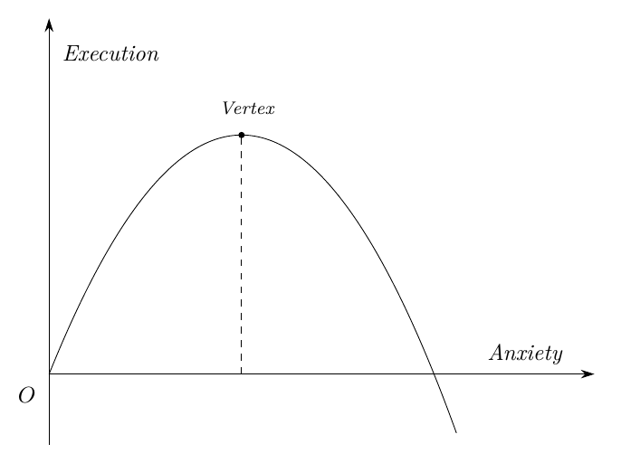

# 2.1.2 The Manufactured Citizens

I use the term “natural selection” deliberately. What I encountered was an educational environment in which competition, ranking, examination performance, and individual academic advancement were presented not merely as institutional arrangements, but as apparently natural facts about social existence. The metaphor of an arena is therefore important. I did not perceive myself as simply participating in an educational process designed to cultivate my abilities. I increasingly perceived myself as competing for a position within a fixed hierarchy, in which failure to compete sufficiently would carry consequences extending far beyond the immediate educational environment. What makes this experience particularly difficult to reconstruct is that it did not take the form of a formal declaration. There was no identifiable moment at which an authority announced that the rules had changed. Instead, it resembled a diffuse and nearly omnipresent social communication: a set of mutually reinforcing statements that appeared to come from everywhere while being attributable to no single source. In retrospect, I might describe it as a kind of collective declaration—or, from a more skeptical perspective, a conspiracy without conspirators. I do not mean that the individuals involved had literally coordinated their behavior. Rather, the striking feature was that the same worldview could emerge independently across institutions and social environments, producing the impression of a coordinated system without requiring an identifiable coordinating agent.

At approximately twelve years of age, I spent considerable amounts of time on Xiaohongshu, another largely enclosed platform within the mainland Chinese Internet environment. Among the content I encountered most frequently were what, from my present perspective, would be classified as highly conventional forms of motivational or “positive-energy” content. These videos purported to teach young people how to work harder, endure hardship, and maximize their academic performance. Their formal structure was remarkably consistent. A typical video would juxtapose accelerated footage of twenty-four hours of studying—often presented as a continuous sequence of reading, writing, reviewing, and preparing for examinations—with a short passage of apparently philosophical text. The accompanying words were frequently delivered in an emotionally earnest voice, as though the speaker were conveying a hard-earned truth about life. I still remember several of these propositions with considerable clarity. They included: “Your temporary effort will create the happiness of three generations: yourself, your parents, and your descendants”; “The Gaokao is a narrow bridge crossed by thousands of competing armies”; “The hardship you endure now is so that, in the future, you will be able to order food without looking at the price”; “The harder you work, the luckier you become”; and “Until the dust has settled, you and I may both yet be dark horses.” These statements may initially appear innocuous. Some might even regard them as harmless encouragement intended to motivate adolescents to take their education seriously. Yet their cumulative meaning deserves much closer examination.

The first problem is not simply that these statements are exaggerated. It is that they construct a particular conception of education and social mobility while presenting that conception as self-evident. The examination system is represented through the metaphor of “thousands of armies crossing a single-plank bridge”: a structure characterized by extreme competition, scarcity of desirable outcomes, and the inevitability of losers. The appropriate response, however, is not presented as questioning the structure itself. Instead, students are encouraged to adapt themselves to it more efficiently. The system is treated as an immutable environment, while the burden of adaptation is transferred almost entirely onto the individual student. This distinction is crucial. There is a substantial difference between telling a student that an examination is difficult and telling the student that the only rational response to a structurally competitive system is to intensify personal sacrifice. The former is descriptive; the latter is normative. It transforms an institutional condition into an individual obligation. The same problem becomes even clearer in the claim that an individual’s temporary effort will determine the happiness of three generations. Such a proposition imposes an extraordinary moral burden upon a child. A twelve- or fifteen-year-old is not merely asked to study for his or her own future. The student is implicitly told that academic performance constitutes an obligation toward parents, ancestors, and descendants. Failure is therefore no longer merely an educational disappointment. It can be interpreted as a failure of filial responsibility and even as a failure toward one’s hypothetical future family.

The proposition that “the harder you work, the luckier you become” presents a different but related problem. It converts a highly contingent social outcome into an apparently predictable function of individual effort. Yet educational attainment is never determined by effort alone. It is shaped by socioeconomic background, educational resources, institutional quality, health, psychological conditions, family circumstances, access to information, geographic location, interpersonal networks, and a substantial element of contingency. To deny these factors is not merely optimistic; it risks converting structural inequality into individual moral failure. If effort reliably produces success, then failure can be interpreted as evidence that the individual simply did not work hard enough. This is where motivational discourse becomes potentially dangerous. Its most consequential feature is not that it encourages effort, but that it suppresses the possibility of questioning the premises upon which effort is demanded. A genuinely responsible educational message could, of course, encourage persistence while simultaneously acknowledging limits. It could tell students that sustained effort matters, but that exhaustion is real; that academic goals are worthwhile, but that one’s health and psychological stability also matter; that competition exists, but that the structure of competition itself can and should be examined. Most importantly, it could tell students that becoming exhausted is not a moral failure and that rest is not equivalent to surrender. The motivational discourse I encountered rarely appeared to make this qualification.

Indeed, it is striking to consider what these videos could have included but generally did not. They could have presented empirical evidence concerning the relationship between anxiety and academic performance. They could have explained that excessive stress can impair concentration, working memory, decision-making, and executive functioning. They could have shown students that productivity is not necessarily a monotonically increasing function of psychological pressure. In graphical terms, one might reasonably represent the relationship between anxiety and effective performance as an inverted-U-shaped curve: insufficient arousal may produce low engagement, while moderate levels can facilitate concentration, but excessive anxiety can eventually reduce effective performance (Figure Figure: Execution Performance vs. Anxiety).

*Figure: Execution Performance vs. Anxiety*

Yet that is not the message these videos were designed to communicate. Their function was not scientific explanation. Their function was emotional mobilization. This distinction matters because emotional mobilization can be extremely effective even when the proposition being communicated is empirically weak. A statement does not become scientifically justified merely because it succeeds in making an adolescent study for another three hours. Indeed, from the perspective of educational responsibility, effectiveness cannot be defined exclusively by whether the desired behavior is successfully produced. The more important question is what psychological and normative mechanism is being used to produce it. In my view, a system that attempts to generate academic progress primarily through fear, guilt, anxiety, and exaggerated promises is adopting an extraordinarily narrow conception of education. It treats the student’s psychological state as an instrument to be manipulated rather than as an aspect of the student’s well-being that education itself ought to protect.

At this point, the argument begins to resemble the problem I examined in the preceding part of this book concerning contemporary Chinese nationalism. There, I argued that a particular form of political reasoning frequently substitutes emotional conviction for sustained engagement with empirical reality. The similarity here is striking. In both cases, a complicated social reality is reduced to an emotionally compelling proposition, and the emotional proposition then becomes resistant to empirical qualification. The parallel should not be overstated. Nationalist discourse and educational motivational content are obviously different phenomena. Their immediate objectives, institutional origins, and social functions cannot simply be assumed to be identical. Yet the similarity in their epistemic structure is difficult to ignore. Both can operate through what might be described as a form of wishful or self-confirming reasoning: the desired conclusion is emotionally established first, while empirical complexity is subsequently subordinated to it.

One might object that the comparison is fundamentally inappropriate because the two phenomena are different in nature. Nationalist rhetoric, on this account, may represent political manipulation or ideological mobilization, whereas motivational educational content at least attempts to help students succeed academically. The latter, even if excessive, is therefore ostensibly directed toward the student’s own interests. Let us provisionally accept this distinction. Even then, a further question remains: on what basis do the creators of such content assume that Chinese society can continue to absorb increasingly intense messages telling students that virtually everything else should be sacrificed for academic advancement? Within the Chinese social context, students already encounter enormous pressure to subordinate leisure, physical well-being, interpersonal relationships, personal interests, and psychological stability to educational achievement. Why, then, should the cultural environment continue to add further moral and emotional pressure to this existing structure?

If the creators of such content seriously reflected upon the implications of their own message, they would encounter a difficult problem. Whether judged from a normative perspective or by its practical consequences, the message offers little reason to believe that additional emotional intensification produces a socially desirable outcome. If such content nevertheless receives substantial attention, two broad explanations become possible. The first is relatively mundane: the creators are following an established trend because it generates attention, engagement, and therefore personal benefit. If this is the case, then the phenomenon reproduces a form of moral inconsistency discussed earlier in this book. The language of student improvement becomes a vehicle through which private interests are pursued. The apparent concern for educational achievement functions as the moral packaging surrounding an economic or reputational incentive. The second possibility is more troubling: the content represents a genuine component of the wider ideological environment in which Chinese education operates. If so, its prevalence would provide further evidence that the political and institutional system has succeeded in reproducing a particular conception of social value across domains that might initially appear unrelated to formal politics. The two explanations are not mutually exclusive. Commercial incentives can reproduce ideological messages precisely because those messages are already culturally effective, while ideological expectations can become commercially profitable precisely because they resonate with existing social anxieties. The resulting system does not require a centralized conspiracy. It requires only a set of mutually reinforcing incentives.

Under either interpretation, the objection that “these things are different in nature” becomes less decisive than it initially appears. If nationalist moralism and educational motivationalism both function as instruments through which individuals are encouraged to subordinate independent judgment to emotionally compelling social imperatives, then their difference in subject matter does not eliminate the possibility of a common structural logic. There is, however, a third possibility that is worth considering. Perhaps the creators genuinely believe what they are saying. Perhaps they sincerely believe that extreme effort is necessary, that academic success is the principal route toward a better life, and that emotional pressure is an acceptable means of motivating adolescents. If this interpretation is correct, the problem becomes even more fundamental. It would imply not merely that these individuals are exploiting students, but that they possess an extraordinarily low estimation of the capacity of their fellow citizens to respond to reasoned persuasion.

This raises at least two questions. First, if a substantial proportion of students can be motivated to improve academically only through emotional provocation, does the relative scarcity of students who respond to rational argument justify abandoning rationality altogether? Second, why should the first response to the problem of motivating students be emotional manipulation and systematic exaggeration rather than explanation, patience, and dialogue? Even if adolescents cannot immediately understand every dimension of an argument, why should this be treated as a reason to withhold the argument from them? I do not intend to provide a complete philosophical answer to either question. Such an undertaking would take us far beyond the immediate scope of this chapter. Moreover, such questions cannot be separated entirely from the technological environment in which contemporary motivational content circulates. Recommendation algorithms, engagement-based platform incentives, peer effects, and the broader attention economy all participate in determining which messages become visible and which disappear. It would therefore be excessively simplistic to attribute the entire phenomenon to the conscious intentions of individual content creators.

Nevertheless, the existence of these mediating mechanisms does not eliminate the underlying problem. Whether the individual creator is rational or irrational, whether the creator has carefully considered the consequences of the message or has merely reproduced familiar cultural conventions, and whether the creator believes that he or she bears a significant moral responsibility for its consequences, the resulting structure remains remarkably difficult to defend. Consider a student who is initially relatively calm about academic competition. After repeated exposure to this form of motivational content, there appear to be only two plausible directions of movement. The student may remain relatively calm, in which case the content has achieved little. Alternatively, the student may become more anxious, more fearful of failure, and more willing to interpret academic performance as a measure of personal worth. What the student is unlikely to acquire from such content is a greater capacity for rational judgment. This asymmetry is significant. A genuinely educational intervention should ideally expand the student’s capacity to understand reality. It should make the student more capable of distinguishing between controllable and uncontrollable factors, short-term and long-term objectives, effort and outcome, and legitimate ambition and destructive self-sacrifice. By contrast, a message whose principal effect is to increase emotional arousal may succeed in increasing immediate compliance without increasing understanding.

The same structural preference for emotional mobilization can be observed beyond education. Rationality and calm deliberation rarely occupy a particularly prominent position in Chinese public discourse. Official political language, for example, frequently relies upon terms such as “hard battles,” “decisive battles,” and “comprehensive victory.” Whether or not each individual occurrence should be interpreted as politically significant, the broader linguistic pattern is difficult to ignore. Across different domains, one repeatedly encounters a conception of social life characterized by permanent struggle, heightened mobilization, and the expectation of collective effort directed toward an overriding objective. I am not suggesting that educational motivational videos and official political rhetoric are identical. They are not. Nor am I claiming that every individual who uses emotionally charged language consciously intends to reproduce a political ideology. The point is narrower: the same preference for mobilization over deliberation appears repeatedly enough to warrant analytical attention. What emerges, therefore, is something resembling a permanent state of mobilization. In politics, society is represented as confronting successive “battles.” In education, students are told that they are participating in an unforgiving competition in which failure may affect not only themselves but their families and descendants. In both cases, the individual is encouraged to respond to uncertainty not by examining the structure that produces it, but by increasing personal effort within that structure.

I therefore wish to establish two narrower propositions. The first concerns the individual experience of children who, like myself, are unusually sensitive to information and to contradictions within the social environment. To ask a child in early adolescence to place unconditional faith in these promises—to believe that extraordinary effort will reliably produce extraordinary outcomes, that academic achievement constitutes a responsibility toward several generations, and that exhaustion should simply be overcome—is, in my view, an unnecessarily cruel demand. The child is being asked to accept a social contract whose terms the child is neither old enough nor institutionally empowered to negotiate. The second proposition is broader. Chinese society, at least within the educational and discursive environment I experienced, appears to leave insufficient institutional and cultural space for rationality, calm deliberation, and epistemic humility. The problem is not merely that emotional rhetoric exists. Every society contains emotional rhetoric. The more consequential problem is that emotional mobilization can become so deeply embedded in the mechanisms through which people are educated, persuaded, and organized that rational restraint begins to appear unnecessary, ineffective, or even morally suspect.

If this interpretation is correct, then the educational problem cannot be reduced to excessive homework, examination pressure, or an unfortunate collection of motivational videos. Those are merely visible manifestations of a deeper institutional logic. The more fundamental question is what kind of human being an educational system produces when it repeatedly teaches children that the appropriate response to structural competition is not to question its premises, but to adapt themselves more completely to it. That question brings us back to the central theme of this chapter: the artifice of natural selection. What appeared to me at the age of twelve as an unavoidable natural order may, upon closer examination, have been something constructed—reproduced through institutions, cultural expectations, technological systems, and repeated acts of persuasion. The competition may have been real. The scarcity of opportunities may have been real. The consequences of failure may have been real. But the proposition that children must therefore sacrifice everything else in order to compete was not a natural law. It was an ideology. And the distinction between the two is precisely where the possibility of criticism begins.
